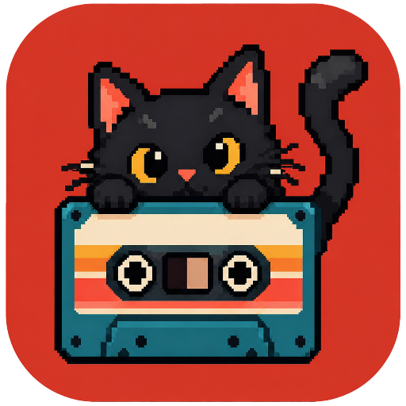

# CassetteCat - Desktop

<p align="center">
  
</p>

<p align="center">
  <strong>A local-first desktop music player for the music you already own.</strong>
</p>

<p align="center">
  Looking for the Android app? <a href="https://github.com/samyyy2311/CassetteCat">CassetteCat for Android</a>
</p>

<p align="center">
  
  <a href="LICENSE"></a>
  <a href="https://www.qt.io"></a>
  
</p>

---

## What it does

### Your music library

- Scan a local music folder and its subfolders.
- Browse songs, artists, and albums.
- Search by song, artist, album, or file format.
- Read embedded metadata and local cover art.

### Playback

- Play, pause, skip, seek, shuffle, and adjust volume.
- Keep an up-next queue while you listen.
- Like tracks for the current session.
- Open a floating MiniPlayer and keep it above other windows.

### Lyrics and artwork

- Read embedded lyrics from supported audio files.
- Show timed `.lrc` lyrics when they are available.
- Use cover art found beside your music or embedded in your files.

### Desktop experience

- Remembers your music folder and window size between launches.
- Runs locally. There is no account, analytics, or music-upload service.

---

## Build and run

You need Qt 6.8 or newer with Qt Quick and Qt Quick Controls 2, CMake 3.24 or
newer, and Ninja.

```powershell
cmake --preset dev
cmake --build --preset dev
.\build\dev\CassetteCat.exe
```

Run the built-in library scan check with:

```powershell
.\build\dev\CassetteCat.exe --self-check
```

---

## Releases

`v0.1` is the first public release. Pushing a tag such as `v0.1` runs the
release workflow and publishes a Windows x64 ZIP with the Qt runtime included.

---

## Contributing

Contributions are welcome. Read [CONTRIBUTING.md](CONTRIBUTING.md) before
opening a pull request. For security issues, read
[SECURITY.md](.github/SECURITY.md).

---

## Credits

- [Qt](https://www.qt.io/) powers the desktop app and user interface.
- [TagLib](https://taglib.org/) reads audio metadata, artwork, and lyrics.
- [Lucide](https://lucide.dev/) provides the interface icons.
- IBM Plex, Space Grotesk, Silkscreen, VT323, and Monocraft provide the bundled
  typefaces.

See [THIRD_PARTY_NOTICES.md](THIRD_PARTY_NOTICES.md) for included notices.

---

## License

CassetteCat Desktop is licensed under the
[GNU General Public License v3.0 or later](LICENSE). Third-party code, fonts,
and artwork keep their own licenses.
