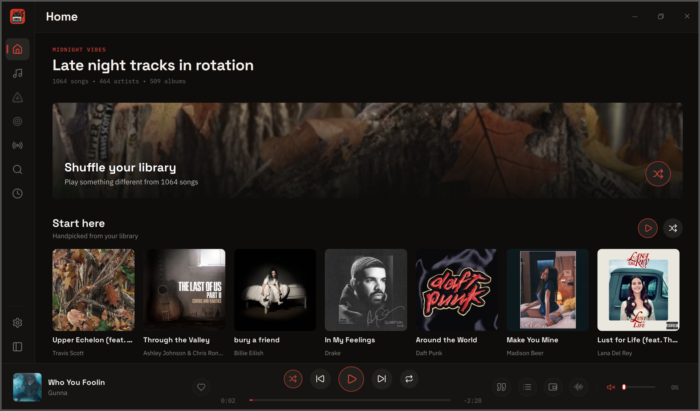
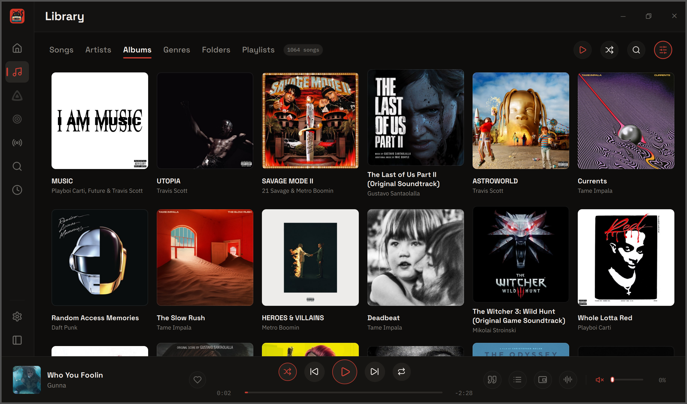
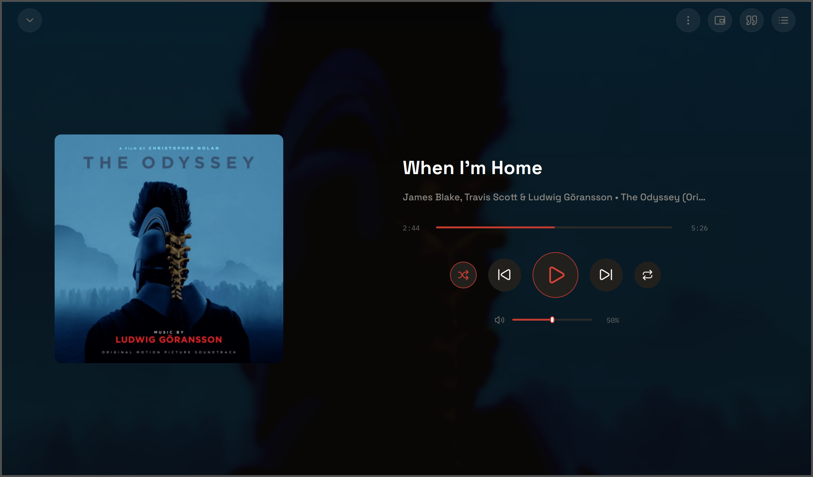
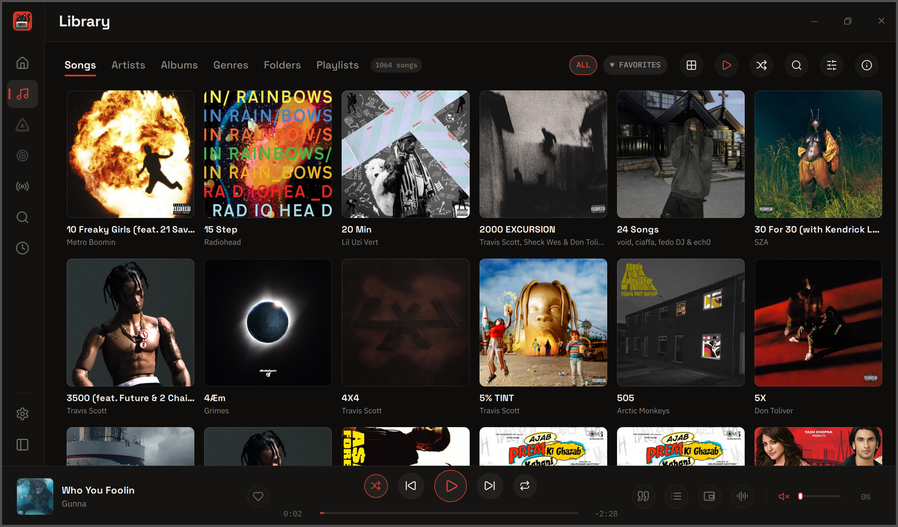
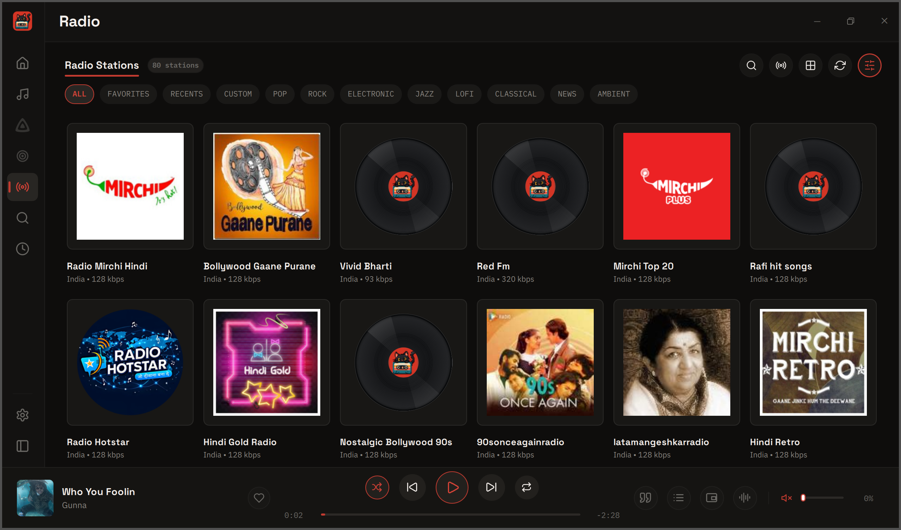

<p align="center">
  
</p>

<h1 align="center">CassetteCat Desktop</h1>

<p align="center">
  <strong>A local-first desktop music player for the music you already own.</strong>
</p>

<p align="center">
  Looking for the Android app? <a href="https://github.com/samyyy2311/CassetteCat">CassetteCat for Android</a>
</p>

<p align="center">
  <a href="https://github.com/samyyy2311/CassetteCat-Desktop/releases/latest"></a>
  <a href="https://github.com/samyyy2311/CassetteCat-Desktop/releases"></a>
  
  <a href="LICENSE"></a>
</p>

<p align="center">
  <a href="https://github.com/samyyy2311/CassetteCat-Desktop/releases/latest"></a>
</p>

<p align="center">
  
</p>

## Features

- **Library.** Browse your music folder by songs, artists, albums, genres and folders, with search, favourites and playlists.
- **Playback.** A queue that survives restarts, ReplayGain, a sleep timer and a floating mini player.
- **Controls.** Media keys, global shortcuts, the tray, and the Windows and Linux media controls. Every screen works from the keyboard.
- **Lyrics and artwork.** Synced lyrics from your files or LRCLIB, covers from your files or the Cover Art Archive, and artist pictures and bios.
- **Listening Record.** Plays, listening time, top songs, artists and albums, full history, and a yearly Recap.
- **Online extras.** Internet radio, Jellyfin and Subsonic, scrobbling to Libre.fm and ListenBrainz, and a Discord status.
- **Privacy.** No account needed. Offline Blackout Mode turns every online lookup off.

## Screenshots

<table>
  <tr>
    <td></td>
    <td></td>
  </tr>
  <tr>
    <td></td>
    <td></td>
  </tr>
</table>

## Install

Download from the [latest release](https://github.com/samyyy2311/CassetteCat-Desktop/releases/latest).

| Platform | File | Notes |
| --- | --- | --- |
| Windows | `setup.exe` | Installer, with optional file associations |
| Windows | `.zip` | Portable. Run `CassetteCat\bin\CassetteCat.exe` |
| Linux | `.AppImage` | Runs on most distributions. Make it executable and run it |
| Linux | `.flatpak` | Install with `flatpak install --user` and the file name |
| Linux | `.deb` | Debian, Ubuntu and derivatives |
| Linux | `.rpm` | Fedora, openSUSE and derivatives |
| Linux | `.tar.gz` | Portable. Run `CassetteCat/bin/CassetteCat` |

Linux builds are x86_64. Each release includes `SHA256SUMS.txt` to verify downloads.

## Build from source

Requires Qt 6.10 or newer (Quick, Quick Controls 2, Multimedia, Network), CMake 3.24 or newer, and Ninja. On Linux, also install the libsecret headers (`libsecret-1-dev` on Debian and Ubuntu).

```bash
cmake --preset dev
cmake --build --preset dev
```

The app is built to `build/dev/`. Run the checks with:

```bash
build/dev/CassetteCat --self-check
ctest --test-dir build/dev --output-on-failure
```

## Contributing

Contributions are welcome. Read [CONTRIBUTING.md](CONTRIBUTING.md) before
opening a pull request. For security issues, read
[SECURITY.md](.github/SECURITY.md).

## Support

<p align="center">
  <a href="https://ko-fi.com/samyyy2311"></a>
  <a href="https://buymeacoffee.com/samyyy2311"></a>
</p>

<p align="center">If CassetteCat is useful to you, support helps keep it improving.</p>

## Credits

### Music and information

- <a href="https://lrclib.net"></a> Lyrics when a track has none locally.
- <a href="https://www.radio-browser.info"></a> Internet radio stations.
- <a href="https://wikipedia.org"></a> Artist information.
- <a href="https://coverartarchive.org"></a> Album covers.
- <a href="https://deezer.com"></a> and <a href="https://theaudiodb.com"></a> Artist images and details.

### Built with

- <a href="https://www.qt.io"></a> Desktop interface and playback.
- <a href="https://taglib.org"></a> Music metadata, artwork, and lyrics.
- <a href="https://lucide.dev"></a> Interface icons.
- <a href="https://github.com/IBM/plex"></a> and <a href="https://github.com/floriankarsten/space-grotesk"></a> Typefaces.

See [THIRD_PARTY_NOTICES.md](THIRD_PARTY_NOTICES.md) for all included notices.

## License

CassetteCat Desktop is licensed under the
[GNU General Public License v3.0 or later](LICENSE). Third-party code, fonts,
and artwork keep their own licenses.
