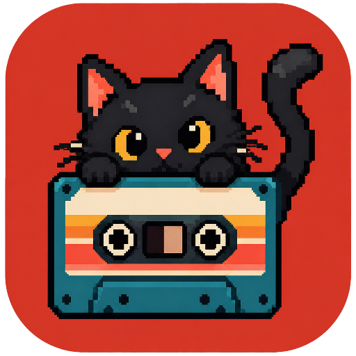
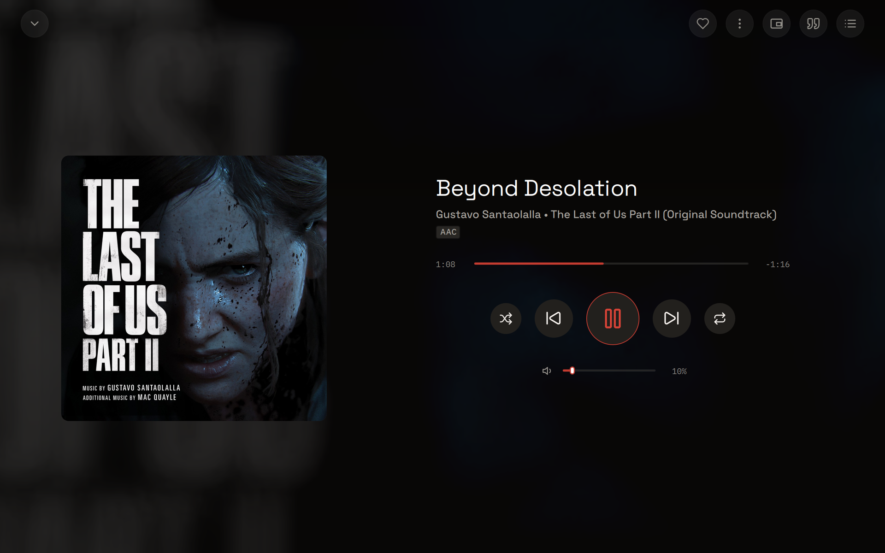
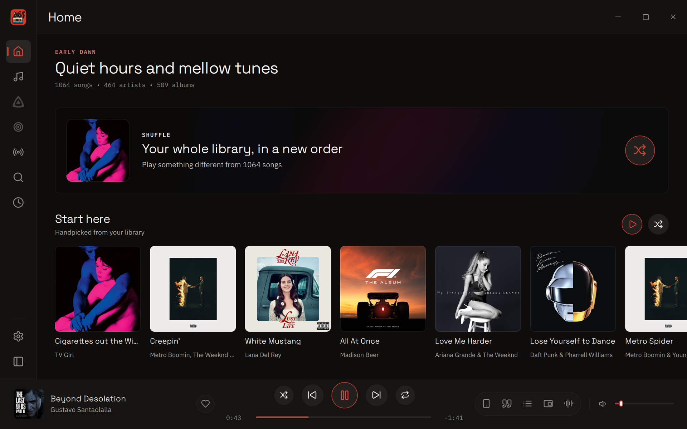
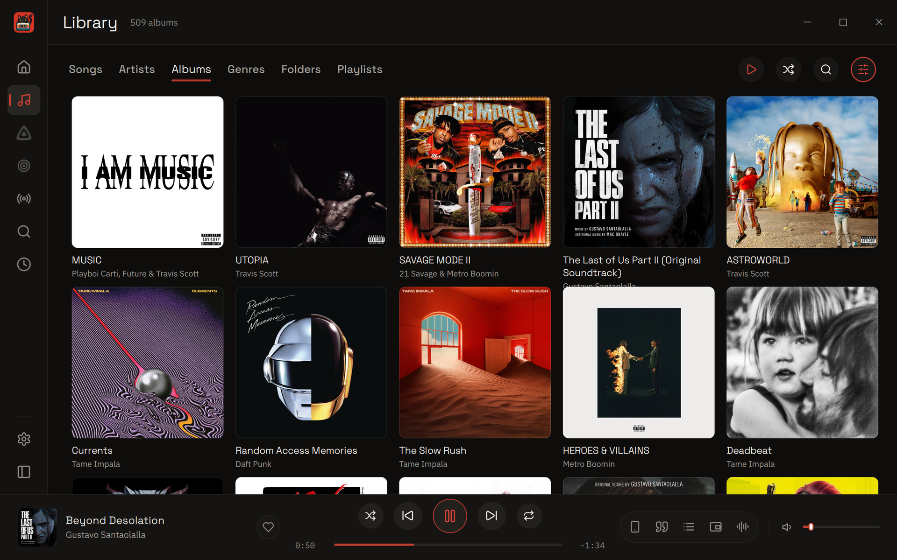
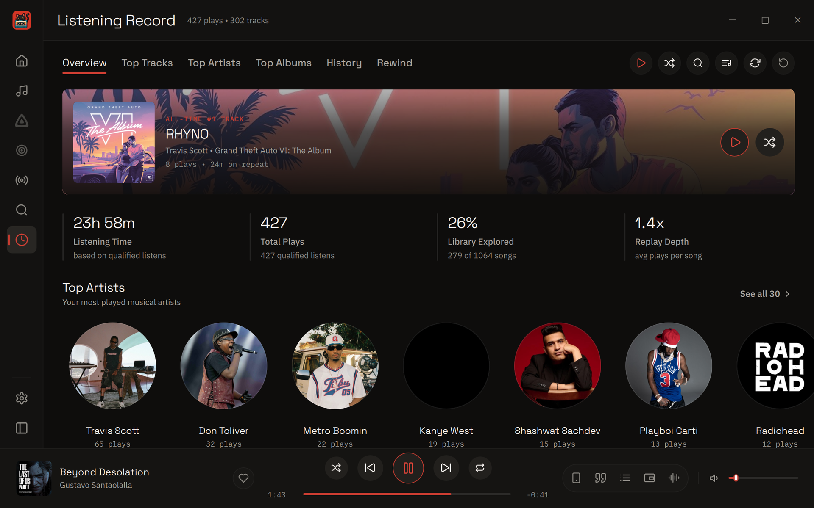
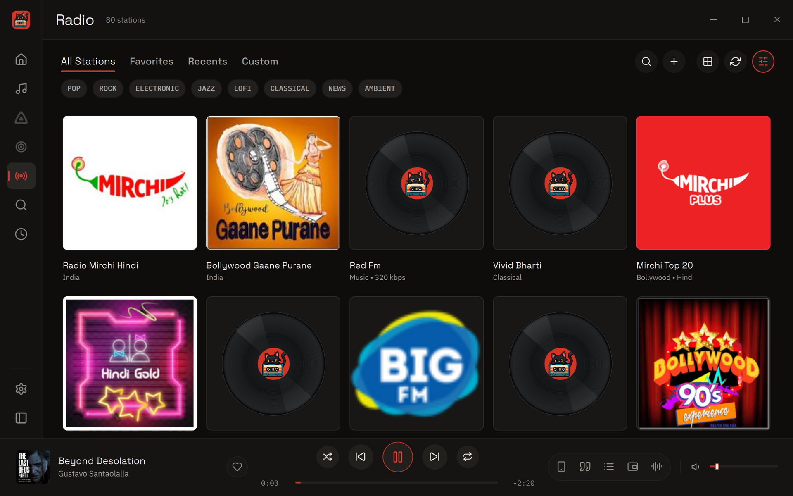

<p align="center">
  
</p>

<h1 align="center">CassetteCat</h1>

<p align="center">
  A desktop music player for the music you own: your own files, your Subsonic or Jellyfin server, and internet radio.<br />
  Pairs with <a href="https://github.com/samyyy2311/CassetteCat">CassetteCat for Android</a>, so your phone becomes a remote and your music moves between the two.
</p>

<p align="center">
  <a href="https://github.com/samyyy2311/CassetteCat-Desktop/releases/latest"></a>
  <a href="https://github.com/samyyy2311/CassetteCat-Desktop/releases"></a>
  <a href="LICENSE"></a>
  
  <a href="https://www.qt.io"></a>
  <a href="https://www.bestpractices.dev/projects/15328"></a>
</p>

<p align="center">
  <a href="#install">Install</a> ·
  <a href="docs/README.md">Docs</a> ·
  <a href="https://cassettecat.caffeinelabs.in/desktop">Website</a> ·
  <a href="CHANGELOG.md">Changelog</a> ·
  <a href="PRIVACY_POLICY.md">Privacy</a>
</p>

<p align="center">
  
</p>

## Install

<p align="center">
  <a href="https://apps.microsoft.com/detail/9NXNRR95X3K0"></a>
</p>

On Windows 10 and 11, the Microsoft Store version updates itself. It's also on the Windows Package Manager:

```powershell
winget install CassetteCat
```

Everything else is on the [latest release](https://github.com/samyyy2311/CassetteCat-Desktop/releases/latest) page:

| System | Download | Notes |
| :--- | :--- | :--- |
| Windows | `setup.exe` | Installer, with optional "Open with" entries for audio files |
| Windows | `.zip` | Portable. Run `CassetteCat\bin\CassetteCat.exe` |
| macOS 13+ | `.dmg` | One app for Apple silicon and Intel. Drag it to Applications |
| Linux | `.AppImage` | Runs on most distributions. Make it executable and run it |
| Linux | `.flatpak` | `flatpak install --user <file>` |
| Linux | `.deb` | Debian, Ubuntu, Linux Mint, Pop!_OS |
| Linux | `.rpm` | Fedora, openSUSE, RHEL |
| Linux | `.tar.gz` | Portable. Run `CassetteCat/bin/CassetteCat` |

Linux packages come for x86_64 and ARM64; pick the one for your machine. Every release lists `SHA256SUMS.txt` for checking your download.

The macOS app isn't notarized by Apple yet. The first time, right-click CassetteCat in Applications and choose **Open**, or allow it under **System Settings > Privacy & Security**.

## Screenshots

<p align="center">
  
  
</p>
<p align="center">
  
  
</p>

## Features

### Your music

- **Your own files**: point it at your music folders and it sorts everything by song, album, artist, genre and folder, and picks up new files as you add them. FLAC, MP3, AAC, M4A, ALAC, OGG, Opus and WAV all play.
- **Your server**: stream from Subsonic-compatible servers (Navidrome, Gonic, Airsonic) or Jellyfin, with Quick Connect, alongside your local library.
- **Internet radio**: live stations from [Radio Browser](https://www.radio-browser.info), plus stations you add yourself.
- **Tag editor**: fix the artist, album, genre, year, lyrics and cover art of many songs at once, written back to the files with [TagLib](https://taglib.org).
- **Playlists**: make them from a selection or the queue, and import or export M3U.
- **Search**: songs, artists and albums as you type, from anywhere with Ctrl+K.

### Listening

- **Gapless playback**, a short fade when you change songs, and crossfade up to 10 seconds.
- **Ten-band equalizer** with [AutoEq](https://github.com/jaakkopasanen/AutoEq) correction curves for your headphones.
- **ReplayGain** by track or album, a volume limit, and a sleep timer with a gentle fade-out.
- **Synced lyrics** from `.lrc` files, tags, Jellyfin or [LRCLIB](https://lrclib.net). For songs with plain lyrics, press Space along with the song once and CassetteCat saves the timings.
- **Audio details**: Hi-Res Lossless, Lossless or the codec at a glance, with the sample rate, bit depth and bitrate a click away.
- **Autoplay** keeps going with similar songs when the queue ends.

### On your desktop

- A floating **mini player** with artwork, lyrics or the queue, kept on top if you like.
- **System media controls**: the media overlay and taskbar buttons on Windows, Now Playing in Control Center on macOS, and MPRIS on Linux.
- **Keyboard shortcuts** for playback, volume, seeking, search and the mini player, all changeable.
- **Close to the system tray**, start minimized, and notifications when the song changes.
- **Listening Record**: top songs, artists and albums, your full history, and monthly and yearly Rewind.
- **Scrobbling** to Last.fm, [ListenBrainz](https://listenbrainz.org) and [Libre.fm](https://libre.fm), and an optional Discord status.

### With your phone

Pair with the Android app over your home Wi-Fi by clicking **Allow** when the phone asks. Then:

- your phone controls the computer, also from its notification and volume keys;
- the song, queue and position move between the two, and music plays on one device at a time;
- your phone can browse this computer's music and play it here or stream it;
- likes and playlists stay in sync, both apps keep one Listening Record, and the phone keeps a daily backup here.

The connection stays on your network and is encrypted. See [Using CassetteCat with your phone](docs/guide/phone-remote.md).

### Private by default

No account, no telemetry, no analytics. Your library, history and settings stay on your computer, and passwords are kept in the system's credential store. **Offline Blackout Mode** turns off every internet request with one switch. The details are in [PRIVACY_POLICY.md](PRIVACY_POLICY.md).

## Building from source

CassetteCat is written in C++20 with Qt 6. You need Qt 6.10 or newer, CMake 3.24 or newer, Ninja and OpenSSL 3; on Linux also `libsecret-1-dev`, and on macOS the Xcode command line tools.

```bash
cmake -S . -B build/dev -G Ninja -DCMAKE_BUILD_TYPE=Debug -DCMAKE_PREFIX_PATH=/path/to/Qt/6.x/<platform>
cmake --build build/dev
ctest --test-dir build/dev --output-on-failure
```

See [Building and testing](docs/dev/building.md) for each system's details.

## Documentation

- [User guide](docs/README.md#using-the-app): installing, every feature, the phone remote and troubleshooting
- [Developer guide](docs/README.md#working-on-the-code): building, architecture, design and releasing
- [Privacy policy](PRIVACY_POLICY.md)
- [Third-party notices](THIRD_PARTY_NOTICES.md)

## Contributing

Read [CONTRIBUTING.md](CONTRIBUTING.md) before opening a pull request, and [AI_DISCLOSURE.md](AI_DISCLOSURE.md) for how AI assistance is used here. Report security issues privately, as described in [SECURITY.md](.github/SECURITY.md).

## Support

If CassetteCat is useful to you, you can support its development:

<p align="center">
  <a href="https://ko-fi.com/samyyy2311"></a>
  <a href="https://buymeacoffee.com/samyyy2311"></a>
</p>

## Credits

**Services:** [LRCLIB](https://lrclib.net) for lyrics, [Cover Art Archive](https://coverartarchive.org) and [MusicBrainz](https://musicbrainz.org) for artwork and metadata, [Radio Browser](https://www.radio-browser.info) for stations, [Last.fm](https://www.last.fm), [ListenBrainz](https://listenbrainz.org) and [Libre.fm](https://libre.fm) for scrobbling, [Wikipedia](https://wikipedia.org) for artist biographies (CC BY-SA 4.0), [Deezer](https://deezer.com) and [TheAudioDB](https://theaudiodb.com) for artist images, and [GitHub](https://github.com) for update checks.

**Libraries and design:** [Qt 6](https://www.qt.io) for the interface and playback, [TagLib](https://taglib.org) for tags and artwork, [OpenSSL](https://www.openssl.org) for the phone remote's encryption, [AutoEq](https://github.com/jaakkopasanen/AutoEq) for headphone curves, [Lucide](https://lucide.dev) and [Simple Icons](https://simpleicons.org) for icons, and [IBM Plex](https://github.com/IBM/plex) and [Space Grotesk](https://github.com/floriankarsten/space-grotesk) for type.

Code review on this project is done with the help of [CodeRabbit](https://coderabbit.ai), which supports open-source projects with free reviews. CassetteCat is also listed on [AlternativeTo](https://alternativeto.net/software/cassettecat/about/).

## License

CassetteCat is licensed under the [GNU General Public License v3.0 or later](LICENSE). Third-party libraries, fonts and assets keep their own licenses.
