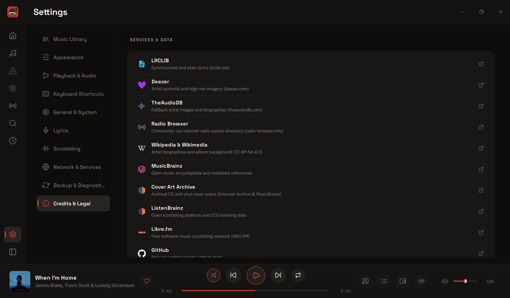
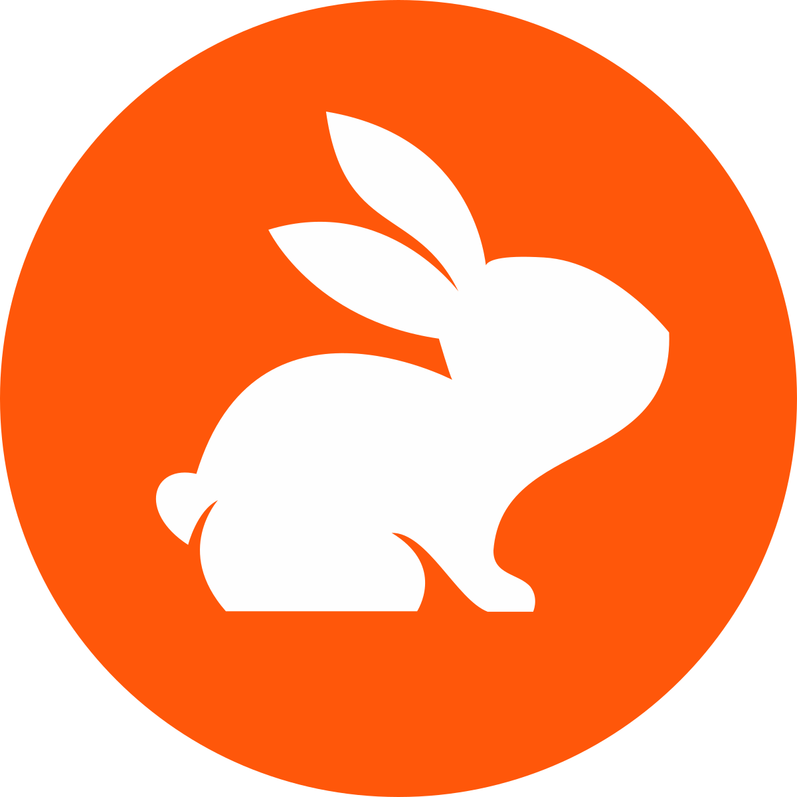

# CassetteCat

<p align="center">
  
</p>

<p align="center">
  <strong>A local-first desktop music player for the music you already own, with support for local files, Subsonic, and Jellyfin.</strong>
</p>

<p align="center">
  Android app: <a href="https://github.com/samyyy2311/CassetteCat">CassetteCat for Android</a>
</p>

<p align="center">
  Website: <a href="https://cassettecat.caffeinelabs.in">cassettecat.caffeinelabs.in</a>
</p>

<p align="center">
  <a href="CHANGELOG.md"></a>
  <a href="LICENSE"></a>
  
  
  <a href="https://www.qt.io"></a>
  
  <a href="https://alternativeto.net/software/cassettecat/about/"></a>
  <a href="https://github.com/samyyy2311/CassetteCat-Desktop/releases"></a>
  <a href="https://coderabbit.ai"></a>
</p>

---

## Install

<p align="center">
  <a href="https://apps.microsoft.com/detail/9NXNRR95X3K0">
    
  </a>
</p>

<p align="center">
  <strong>Windows 10/11, macOS 13+ & Linux (x86_64 and ARM64)</strong><br />
  Install through the Microsoft Store for background updates, via <code>winget</code>, or download standalone binaries below.
</p>

### Windows Package Manager (winget)

```powershell
winget install CassetteCat
```

### Standalone Packages

Download from the [latest release](https://github.com/samyyy2311/CassetteCat-Desktop/releases/latest).

| Platform | Format | Package | Notes |
| :--- | :--- | :--- | :--- |
| **Windows** | Installer | `setup.exe` | Recommended installer with optional file associations |
| **Windows** | Portable | `.zip` | Standalone archive. Run `CassetteCat\bin\CassetteCat.exe` |
| **macOS** | Disk image | `.dmg` | One app for Apple silicon and Intel. Drag it to Applications |
| **Linux** | Universal | `.AppImage` | Runs on most Linux distributions. Make executable and run |
| **Linux** | Flatpak | `.flatpak` | Install with `flatpak install --user <file>` |
| **Linux** | Debian | `.deb` | Debian, Ubuntu, Linux Mint, and Pop!_OS |
| **Linux** | RPM | `.rpm` | Fedora, openSUSE, and RHEL |
| **Linux** | Tarball | `.tar.gz` | Portable archive. Run `CassetteCat/bin/CassetteCat` |

Linux packages are built for both x86_64 and ARM64; pick the one matching your machine.

The macOS app is not notarized by Apple yet, so the first time, right-click CassetteCat in Applications and choose **Open**, or allow it under **System Settings > Privacy & Security**.

> Each release includes `SHA256SUMS.txt` for integrity verification.

---

## Screenshots

<p align="center">
  
  
</p>
<p align="center">
  
  
</p>
<p align="center">
  
  
</p>

---

## Features

### Playback

- **Gapless & Crossfade**: Seamless track transitions, ReplayGain volume normalization, a sleep timer, and a floating mini player.
- **Persistent Queue**: Your current queue and playback position survive app restarts. Autoplay keeps the music going with similar tracks when your queue ends.
- **Synchronized Lyrics**: Karaoke-style lyrics from local `.lrc` files, embedded ID3 tags, or LRCLIB, plus a built-in tap-to-sync tool for unsynced tracks.
- **System Controls**: Native Windows Media Transport Controls (SMTC), Linux MPRIS, system tray controls, and global keyboard shortcuts. Every screen can be navigated entirely from the keyboard.

### Library & Organization

- **Local Collection**: Fast indexing for your local music folder with full support for FLAC, MP3, AAC, M4A, OGG, Opus, WAV, and ALAC.
- **Batch Tag Editor**: Edit metadata, track numbers, genres, and cover art across multiple files at once using [TagLib](https://taglib.org).
- **Listening Record**: Tracks your play counts, total listening time, top artists, and full history, with monthly and yearly Rewind summaries.

### Streaming & Radios

- **Subsonic & Navidrome**: Native streaming client for Subsonic-compatible servers including Navidrome, Gonic, and Airsonic.
- **Jellyfin**: Stream your personal music library directly from a Jellyfin server.
- **Internet Radio**: Tune into thousands of live radio stations worldwide through [Radio Browser](https://www.radio-browser.info).
- **Scrobbling & Presence**: Scrobble to [ListenBrainz](https://listenbrainz.org) and [Libre.fm](https://libre.fm), with Discord Rich Presence status support.

### Phone Remote

- **Wi-Fi Sync**: Pair with [CassetteCat for Android](https://github.com/samyyy2311/CassetteCat) on your local network. Handoff your current song, queue, and playback progress between phone and computer, keep favorites in sync, and mirror backups.

### Privacy

- **No Accounts or Tracking**: Everything stays on your machine. No telemetry, no analytics, and no accounts required. See [PRIVACY_POLICY.md](PRIVACY_POLICY.md) for full details.
- **Offline Blackout Mode**: A single switch turns off every external network call for completely offline listening.
- **GPL-3.0**: Fully open-source software.

---

## Building

Requires Qt 6.10 or newer (Quick, Quick Controls 2, Multimedia, Network), CMake 3.24 or newer, and Ninja. On Linux, also install `libsecret-1-dev`.

```bash
cmake --preset dev
cmake --build --preset dev
```

The app is built to `build/dev/`. Run the test suite:

```bash
build/dev/CassetteCat --self-check
ctest --test-dir build/dev --output-on-failure
```

---

## Contributing

Contributions are welcome. Please read [CONTRIBUTING.md](CONTRIBUTING.md) before opening a pull request, and [AI_DISCLOSURE.md](AI_DISCLOSURE.md) for how AI assistance is used in this project. For security reports, see [SECURITY.md](.github/SECURITY.md).

---

## Support

<p align="center">
  <a href="https://ko-fi.com/samyyy2311"></a>
  <a href="https://buymeacoffee.com/samyyy2311"></a>
</p>

<p align="center">If CassetteCat is useful to you, support helps keep development going.</p>

---

## Credits

### Services & Data

- <a href="https://lrclib.net"></a> Synchronized and plain lyrics.
- <a href="https://coverartarchive.org"></a> Album artwork from MetaBrainz and the Internet Archive.
- <a href="https://musicbrainz.org"></a> Music encyclopedia and metadata.
- <a href="https://listenbrainz.org"></a> Open scrobbling.
- <a href="https://www.radio-browser.info"></a> Internet radio directory.
- <a href="https://libre.fm"></a> Free software scrobbling.
- <a href="https://wikipedia.org"></a> Artist biographies (CC BY-SA 4.0).
- <a href="https://deezer.com"></a> and <a href="https://theaudiodb.com"></a> Artist imagery and details.
- <a href="https://github.com"></a> Release update checks.

### Libraries & Design

- <a href="https://www.qt.io"></a> Desktop interface and multimedia engine.
- <a href="https://taglib.org"></a> Audio metadata, artwork extraction, and tag writing.
- <a href="https://lucide.dev"></a> Interface icons.
- <a href="https://simpleicons.org"></a> Brand icons.
- <a href="https://github.com/IBM/plex"></a> and <a href="https://github.com/floriankarsten/space-grotesk"></a> Typefaces.

---

## Acknowledgements

<p align="center">
  <a href="https://coderabbit.ai">
    
  </a>
</p>

<p align="center">
  Special thanks to <a href="https://coderabbit.ai">CodeRabbit</a> for supporting open-source development with automated AI code reviews.
</p>

---

## License

CassetteCat Desktop is licensed under the [GNU General Public License v3.0 or later](LICENSE). Third-party libraries, fonts, and assets retain their respective licenses.
