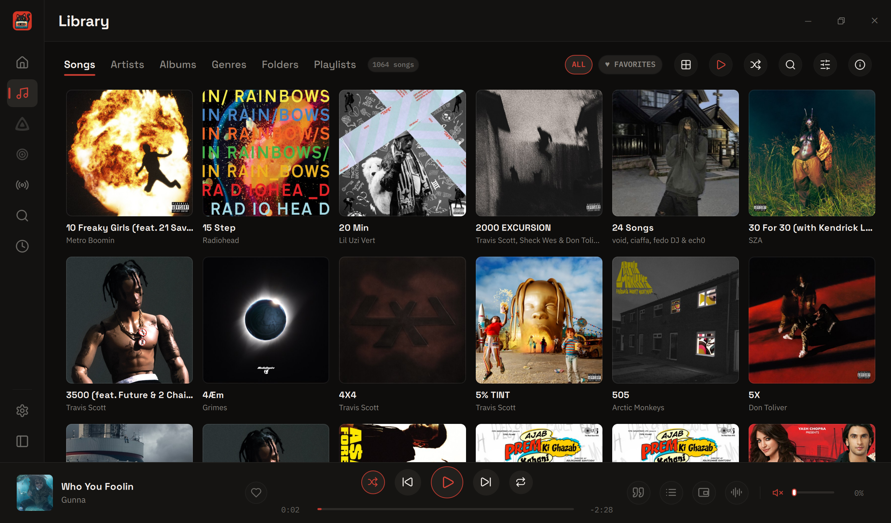

<p align="center">
  
</p>

<h1 align="center">CassetteCat</h1>

<p align="center">
  A desktop music player for the music you already own: your local files, your Subsonic or Jellyfin server, and internet radio.<br />
  Pairs with <a href="https://github.com/samyyy2311/CassetteCat">CassetteCat for Android</a>, so a song can move between your phone and your computer.
</p>

<p align="center">
  <a href="https://github.com/samyyy2311/CassetteCat-Desktop/releases/latest"></a>
  <a href="https://github.com/samyyy2311/CassetteCat-Desktop/releases"></a>
  <a href="LICENSE"></a>
</p>

<p align="center">
  <a href="#install">Install</a> ·
  <a href="https://cassettecat.caffeinelabs.in">Website</a> ·
  <a href="CHANGELOG.md">Changelog</a> ·
  <a href="PRIVACY_POLICY.md">Privacy</a>
</p>

<p align="center">
  
</p>

## Your phone and your computer, one queue

Pair CassetteCat with the Android app over your home Wi-Fi and the phone becomes a remote for your computer. Pick the computer from the phone's device list and the song, the queue and the position move across; pick the phone and they come back. Likes stay in sync both ways, and the phone can keep its backups on your computer.

Pairing takes a six-character code from Settings, Network. Nothing leaves your network.

## What it plays

**Your own files.** Point it at your music folder and it sorts everything by song, album, artist and folder. FLAC, MP3, AAC, M4A, ALAC, OGG, Opus and WAV all play, and the tag editor ([TagLib](https://taglib.org)) can fix artist, album, genre, year and cover art on many files at once.

**Your server.** Stream from Subsonic-compatible servers (Navidrome, Gonic, Airsonic) or from Jellyfin, alongside your local library.

**Radio.** Live stations from the [Radio Browser](https://www.radio-browser.info) directory, with their own page apart from your library.

## How it plays

- Crossfade between songs, ReplayGain to keep volume even, and a sleep timer.
- A queue that survives restarts. When it runs out, Autoplay continues with songs like the last one.
- Synced lyrics from `.lrc` files, embedded tags or [LRCLIB](https://lrclib.net). For songs with plain lyrics, tap along once and CassetteCat saves the timings into the file.
- A floating mini player, media keys, system tray controls, and keyboard shortcuts for playback, volume, seeking, search and the quick switcher.
- Windows media controls on Windows and MPRIS on Linux, so the system's own player controls work.
- Listening Record keeps your play counts, top artists and history, with monthly and yearly Rewind summaries.
- Scrobbling to [ListenBrainz](https://listenbrainz.org) and [Libre.fm](https://libre.fm), and an optional Discord status.

## Private by default

No account, no telemetry, no analytics. Your library, history and settings stay on your computer. Offline Blackout Mode turns off every internet request with one switch, for when you only want your own files. The details are in [PRIVACY_POLICY.md](PRIVACY_POLICY.md).

## Install

<p align="center">
  <a href="https://apps.microsoft.com/detail/9NXNRR95X3K0">
    
  </a>
</p>

On Windows 10 and 11, the Microsoft Store version updates itself. It is also on the Windows Package Manager:

```powershell
winget install CassetteCat
```

Everything else is on the [latest release](https://github.com/samyyy2311/CassetteCat-Desktop/releases/latest) page:

| System | Download | Notes |
| :--- | :--- | :--- |
| Windows | `setup.exe` | Installer, with optional "Open with" entries for audio files |
| Windows | `.zip` | Portable. Run `CassetteCat\bin\CassetteCat.exe` |
| macOS 13+ | `.dmg` | One app for Apple silicon and Intel. Drag it to Applications |
| Linux | `.AppImage` | Runs on most distributions. Make it executable and run it |
| Linux | `.flatpak` | `flatpak install --user <file>` |
| Linux | `.deb` | Debian, Ubuntu, Linux Mint, Pop!_OS |
| Linux | `.rpm` | Fedora, openSUSE, RHEL |
| Linux | `.tar.gz` | Portable. Run `CassetteCat/bin/CassetteCat` |

Linux packages come in x86_64 and ARM64 versions; pick the one for your machine. The macOS and ARM64 downloads start with the release after v0.8.0.

The macOS app is not notarized by Apple yet. The first time, right-click CassetteCat in Applications and choose Open, or allow it under System Settings, Privacy & Security.

Every release lists `SHA256SUMS.txt` for checking your download.

## Screenshots

<p align="center">
  
  
</p>
<p align="center">
  
  
</p>

## Building from source

CassetteCat is written in C++20 with Qt 6. You need Qt 6.10 or newer (Quick, Quick Controls 2, Multimedia, Network), CMake 3.24 or newer and Ninja. On Linux, also install `libsecret-1-dev`; on macOS, the Xcode command line tools.

```bash
cmake --preset dev
cmake --build --preset dev
```

The build lands in `build/dev/`. To run the checks:

```bash
build/dev/CassetteCat --self-check
ctest --test-dir build/dev --output-on-failure
```

## Contributing

Read [CONTRIBUTING.md](CONTRIBUTING.md) before opening a pull request, and [AI_DISCLOSURE.md](AI_DISCLOSURE.md) for how AI assistance is used here. Report security issues privately, as described in [SECURITY.md](.github/SECURITY.md).

If CassetteCat is useful to you, you can support its development on [Ko-fi](https://ko-fi.com/samyyy2311) or [Buy Me a Coffee](https://buymeacoffee.com/samyyy2311).

## Credits

**Services:** [LRCLIB](https://lrclib.net) for lyrics, [Cover Art Archive](https://coverartarchive.org) and [MusicBrainz](https://musicbrainz.org) for artwork and metadata, [Radio Browser](https://www.radio-browser.info) for stations, [ListenBrainz](https://listenbrainz.org) and [Libre.fm](https://libre.fm) for scrobbling, [Wikipedia](https://wikipedia.org) for artist biographies (CC BY-SA 4.0), [Deezer](https://deezer.com) and [TheAudioDB](https://theaudiodb.com) for artist images, and [GitHub](https://github.com) for update checks.

**Libraries and design:** [Qt 6](https://www.qt.io) for the interface and playback, [TagLib](https://taglib.org) for tags and artwork, [Lucide](https://lucide.dev) and [Simple Icons](https://simpleicons.org) for icons, and [IBM Plex](https://github.com/IBM/plex) and [Space Grotesk](https://github.com/floriankarsten/space-grotesk) for type.

Code review on this project is done with the help of [CodeRabbit](https://coderabbit.ai), which supports open-source projects with free reviews. CassetteCat is also listed on [AlternativeTo](https://alternativeto.net/software/cassettecat/about/).

## License

CassetteCat is licensed under the [GNU General Public License v3.0 or later](LICENSE). Third-party libraries, fonts and assets keep their own licenses.
